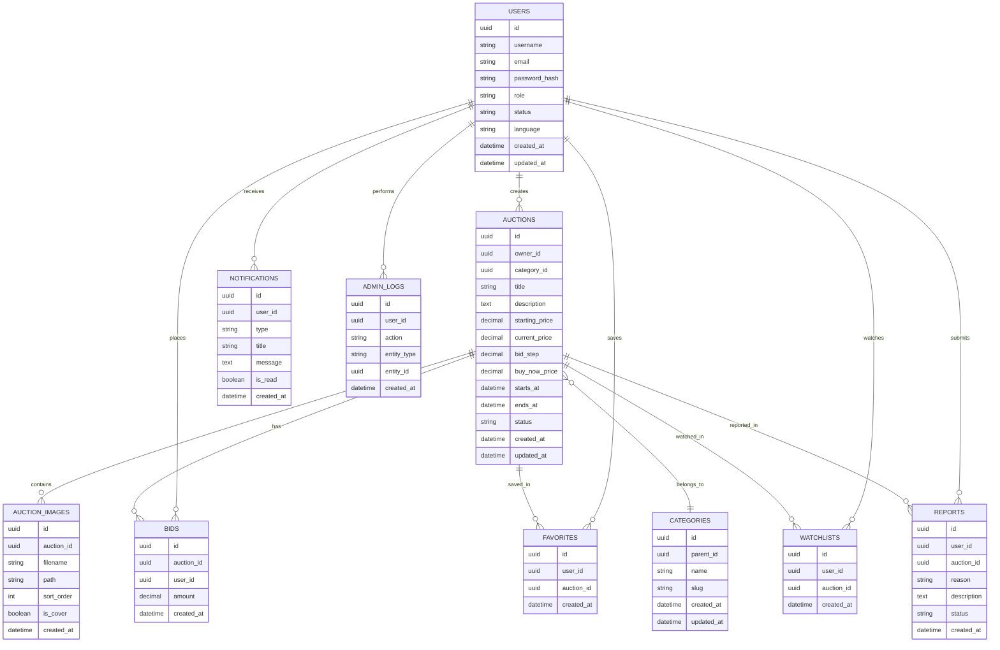

# 🧩 Nightfall Vault – ER diagram

## Cél

Ez a dokumentum a Nightfall Vault fő adatbázis-entitásait és kapcsolatait mutatja be.

Ez még tervezési szint, nem végleges adatbázis-séma.

---

# ER diagram



---

# Fő kapcsolatok

## Felhasználó és aukció

Egy felhasználó több aukciót is létrehozhat.

```text
USERS 1 ─── N AUCTIONS
```

---

## Aukció és licitek

Egy aukcióhoz több licit tartozhat.

```text
AUCTIONS 1 ─── N BIDS
```

---

## Felhasználó és licitek

Egy felhasználó több licitet is leadhat.

```text
USERS 1 ─── N BIDS
```

---

## Aukció és képek

Egy aukcióhoz több kép is tartozhat.

```text
AUCTIONS 1 ─── N AUCTION_IMAGES
```

---

## Felhasználó és kedvencek

Egy felhasználó több aukciót is elmenthet kedvencnek.

```text
USERS 1 ─── N FAVORITES
AUCTIONS 1 ─── N FAVORITES
```

---

## Felhasználó és figyelőlista

Egy felhasználó több aukciót is figyelhet.

```text
USERS 1 ─── N WATCHLISTS
AUCTIONS 1 ─── N WATCHLISTS
```

---

# Megjegyzések

A `FAVORITES` és `WATCHLISTS` külön táblában maradnak, mert később eltérő logikát kaphatnak.

Például:

* kedvenc: egyszerű mentés
* figyelőlista: értesítések, licitfigyelés, aukciózárás előtti jelzés

---

# Későbbi bővítések

A későbbi sprintekben új táblák kerülhetnek be:

* payments
* vip_memberships
* tokens
* invoices
* messages
* reviews
* auction_events
* system_settings

---

# Fontos szabály

Ez a diagram Sprint 0-s tervezési állapotot mutat.

A tényleges implementáció előtt minden táblát külön validálunk:

* szükséges-e már az MVP-hez,
* milyen mezők kellenek,
* milyen indexek szükségesek,
* milyen biztonsági szabályok vonatkoznak rá.
